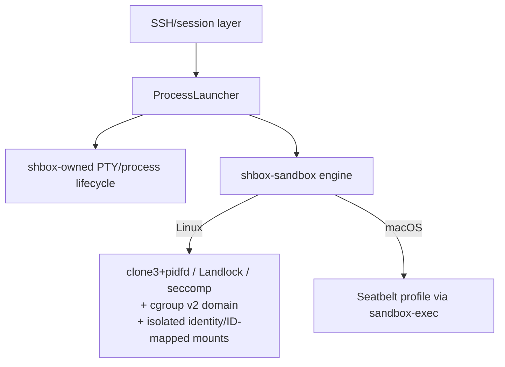

# shbox specification

このディレクトリは shbox v0.1 の外部契約、内部境界、security/release 条件を記述する。実装と文書が衝突した場合は、release 前にどちらかを修正して一致させる。古い backend や移行用互換経路を仕様として残さない。

## Reading order

1. [product.md](product.md) — 利用者から見た目的、SSH 操作、非目標
2. [architecture.md](architecture.md) — lifecycle、`ProcessLauncher`、PTY/process ownership
3. [configuration.md](configuration.md) — TOML、XDG path、built-in concurrency caps
4. [ssh-protocol.md](ssh-protocol.md) — SSH request/stream/signal semantics
5. [security.md](security.md) — trust boundary、OS confinement、既知の限界
6. [platforms.md](platforms.md) — Linux/macOS backend と正式 support 条件
6a. [requirements.md](requirements.md) — OS/account/kernel/cgroup/user ID の動作要件（特に Linux）
7. [testing.md](testing.md) — unit/OpenSSH/native platform acceptance
8. [release.md](release.md) — blocking CI、release evidence、deployment gate
9. [maintenance.md](maintenance.md) — upstream 依存関係の更新・追従体制

## Normative language

`must` / 「必須」は release-blocking contract、`must not` / 「禁止」は実装・運用の禁止事項を表す。`may` / 「可能」は optional behavior である。

正式 support は「コンパイルできる」ことではなく、対象 OS/architecture 上で実 confinement と実 OpenSSH/PTTY acceptance が passing であることを意味する。

## Core vocabulary

- **Principal**: 認証済み Ed25519 public key fingerprint と role の組。
- **Sandbox**: durable metadata と workspace を持つ shbox resource。ID は `[A-Za-z0-9][A-Za-z0-9-]{0,63}`。
- **Workspace**: sandbox に永続する唯一の writable project tree。
- **Launch**: shell/exec 一回に対応する disposable process lifecycle。process と PTY は durable ではない。Linux の private `TMPDIR` は sandbox runtime-domain generation の寿命を持つ。
- **ProcessLauncher**: backend-neutral な private launch seam。SSH 層は OS confinement implementation を知らない。
- **PTY**: shbox が直接 allocate/own する pseudo-terminal。OS confinement layer の責務ではない。
- **Host mode**: admin key が username `_` を使ったときだけ利用できる daemon account 上の非-sandbox route。

## Current architecture

```text
SSH/session layer
    -> ProcessLauncher
        -> shbox-owned PTY/process lifecycle
        -> shbox-sandbox engine
            Linux: clone3+pidfd / Landlock / seccomp
                   (+ durable cgroup v2 process domain via CLONE_INTO_CGROUP)
                   (+ subordinate identity / ID-mapped mounts when
                    sandbox identity = "isolated")
             macOS: generated Seatbelt profile via /usr/bin/sandbox-exec
```



Linux では workspace 内の shbox-sandbox crate が confinement engine と sandbox process domain cgroup を担い、project-owned な外部 sandbox CLI や sibling helper を必要としない（Linux launch には writable な cgroup delegation が必要。`identity = "isolated"` では加えて daemon account への subordinate UID/GID delegation と root で socket activation される `shbox-idmap-broker` が必要で、`newuidmap`/`newgidmap`/`getsubids` は administrator 所有の shadow-utils helper である）。restart 時は delegated parent の shbox 所有 process domain と runtime temp を自動 reconciliation する。macOS では parent process が Seatbelt profile を構築し、固定 OS component である `/usr/bin/sandbox-exec` に適用を委ねる。project-owned external helper は禁止し、この OS component だけを例外として許可する。両 OS とも PTY/session/process-group lifecycle は shbox 自身が所有する。

## Change discipline

- public config に backend selector や undocumented/raw backend option を追加しない。
- sandbox resource limits は explicit な `[sandbox]` 設定でのみ付与する（[configuration.md](configuration.md) §4.4）。engine 側の preset/profile は作らない。
- PTY failure を pipe ベースの疑似 interactive mode で回避しない。
- Linux confinement failure を unconfined execution に degrade しない。
- macOS Seatbelt prerequisite failure を unconfined execution に degrade しない。
- release 前に [testing.md](testing.md) と [release.md](release.md) の blocking matrix を実行する。
