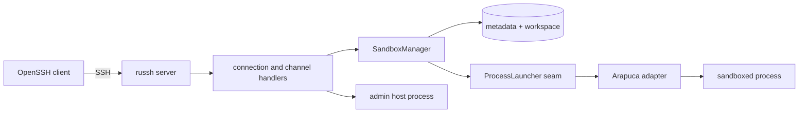
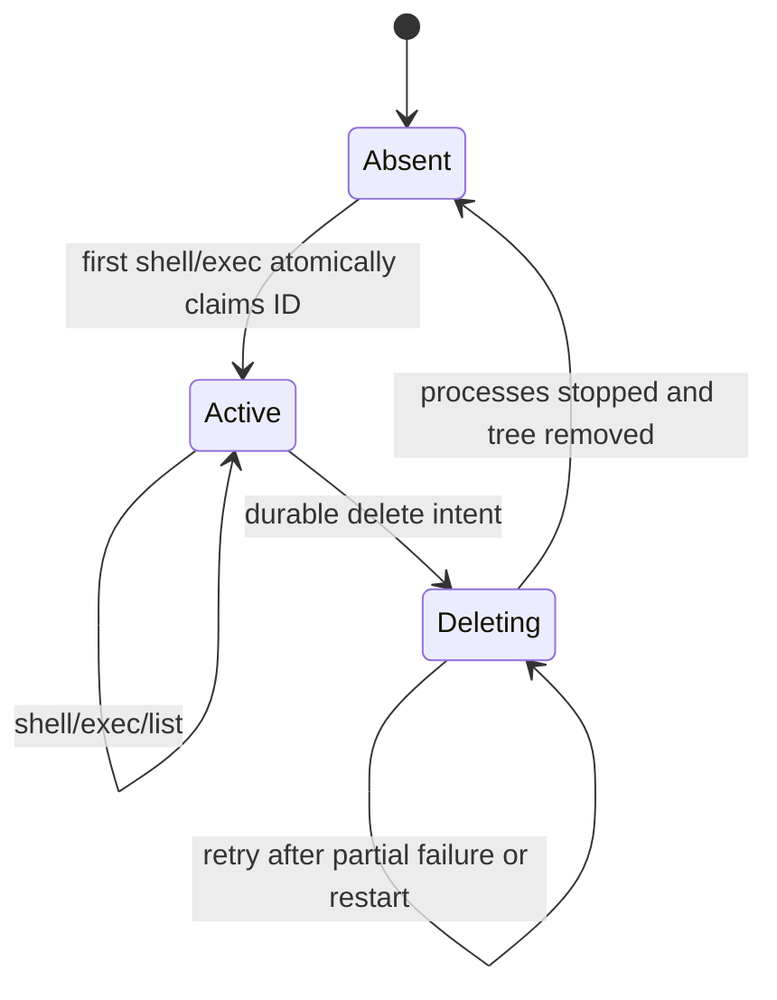

# Architecture and lifecycle

この文書は、shbox の内部境界、永続状態、並行処理、復旧手順を規定する。
利用者向けの操作は [product.md](product.md)、SSH channel の詳細は
[ssh-protocol.md](ssh-protocol.md)、認証境界は [security.md](security.md) を参照する。

本文中の「必須」「禁止」は v0.1 の要件である。「推奨」は、同等の性質を証明できる
実装へ置き換えられる。

## 1. System boundary

shbox は foreground で動作する単一 host・単一 process の SSH daemon である。HTTP API、
専用 client、multi-node scheduler、永続 terminal session は持たない。



重要な境界は次のとおりである。

- shbox の **sandbox** は、shbox が永続化する metadata と workspace の組である。
- Arapuca の通常の Process backend は、一回の process 起動を隔離する primitive である。
  永続 sandbox object、registry、create/list/delete API ではない。
- 同じ sandbox の複数 process は同じ workspace を共有するが、別々の Arapuca
  `Process` として起動する。
- host selector `_` の process は Arapuca を経由しない。daemon と同じ OS uid/gid の
  host process であり、認証済み admin だけが起動できる。

## 2. Domain model

### 2.1 Validated values

raw SSH input や TOML string は、validation が完了するまで domain value として扱わない。
少なくとも次の型を分ける。

- `SandboxId`: ASCII 1--64 bytes、正規表現
  `[A-Za-z0-9][A-Za-z0-9-]{0,63}` に一致する case-sensitive ID
- `KeyFingerprint`: Ed25519 public key の OpenSSH SHA-256 fingerprint
- `Principal`: fingerprint と、通常鍵または admin の role を含む認証結果
- `Selector`: validated `SandboxId` または予約済みの `Host` (`_`)
- `ConnectionId` / `ChannelId` / `ProcessId`: log と runtime registry 用の opaque ID

`_` は `SandboxId` ではない。raw string と validated value の混用、および path 文字列の
連結による sandbox 解決は禁止する。

### 2.2 Persistent sandbox record

各 sandbox は、正本となる v1 metadata を一つ持つ。

```toml
version = 1
id = "dev"
owner = "SHA256:base64-without-padding"
state = "active"
```

`state` の wire value は `active` または `deleting` だけである。概念上はそれぞれ
**Active**、**Deleting** と呼ぶ。未知 field、未知 version、ID と directory 名の不一致、
不正 fingerprint、不正 state は corruption である。自動 migration は行わない。

owner は sandbox を最初に作成した正確な public key fingerprint であり、admin key も
例外ではない。v0.1 は共有 owner、譲渡、owner rotation を持たない。

### 2.3 State machine



- create 用の永続 **Creating** state は設けない。metadata の atomic publish が create の
  commit point である。
- directory はあるが valid metadata がない状態は `Absent` ではなく **Blocked/Corrupt**
  として扱う。同じ ID を自動再利用、削除、修復してはならない。
- `Deleting` は list から隠し、新しい shell/exec を拒否する。
- delete 完了後の同じ ID は、後続の shell/exec により新しい owner で再作成できる。

## 3. Persistent layout

XDG path の解決には `xdg` crate を使い、shbox が `HOME` fallback を再実装しない。

```text
$XDG_CONFIG_HOME/shbox/
└── config.toml                 # optional

$XDG_DATA_HOME/shbox/
├── registry.lock              # sandbox data root の排他的 advisory lock
└── sandboxes/
    └── <id>/
        ├── metadata.toml       # v1 record, mode 0600
        └── workspace/          # persistent HOME and cwd, mode 0700

$XDG_STATE_HOME/shbox/
├── host_key                    # Ed25519 private host key, mode 0600
└── lock                        # daemon state root の排他的 advisory lock
```

標準 fallback は、それぞれ `~/.config/shbox`、`~/.local/share/shbox`、
`~/.local/state/shbox` である。sandbox root、host key path、二つの lock path は v0.1 では固定し、
config option にしない。persistent data を `XDG_RUNTIME_DIR` へ置かない。

管理 directory は daemon user 所有かつ原則 mode `0700`、管理 file は `0600` とする。
group/world writable な config、authorized keys、host key、その管理 parent は拒否する。
local filesystem と、atomic rename・directory `fsync` を提供する通常の POSIX semantics を
前提とする。

management path の解決では no-follow/open-at 相当の安全な操作を使う。`metadata.toml` や
`workspace` 自体が symlink、device、FIFO、socket など期待外の file type なら corruption
として block する。workspace 内部に利用者が作る symlink は許可するが、delete は
sandbox directory の外へ絶対に辿ってはならない。

## 4. Module boundaries

### 4.1 `SandboxManager`: deep lifecycle module

`SandboxManager` は次の知識を一箇所へ隠蔽する深い Module である。

- owner authorization と存在秘匿
- metadata の読み書き、状態遷移、reconciliation
- per-ID lock と count limit
- workspace 作成・安全な再利用・安全な削除
- active process registry
- list/create/delete/shutdown の concurrency semantics
- Arapuca launch 用の内部 profile と task ID

SSH handler が filesystem layout、Arapuca `Process`、metadata TOML を直接操作することを
禁止する。SSH 側の Interface は、概念的に次の小さい操作だけを使う。

```rust
trait SandboxService {
    async fn launch(&self, request: LaunchRequest) -> Result<RunningProcess, RequestError>;
    async fn list(&self, principal: &Principal) -> Result<Vec<SandboxId>, RequestError>;
    async fn delete(&self, principal: &Principal, id: &SandboxId) -> Result<(), RequestError>;
}
```

これは public plugin API を意味しない。実際の型は crate-private とし、必要な protocol
情報だけを request/response value に含める。

### 4.2 `ProcessLauncher`: private test seam

`ProcessLauncher` は process 起動と終了を差し替えるための private Seam である。
production Adapter は Arapuca と OS PTY/ioctl/process-group 操作を包む。test Adapter は
barrier、失敗注入、遅延、確定した exit/output を提供する。

backend selector や利用者設定可能な Adapter は作らない。Arapuca 固有の profile field、
cgroup path、seccomp mode などを config や SSH interface に漏らさない。

filesystem 全体を抽象化する trait は作らない。storage test は temporary XDG directory の
実 filesystem を使う。

### 4.3 Suggested source layout

実装時の初期 layout は次を基準とする。責務を深く保てる場合は file 分割を変えてよい。

```text
src/
├── main.rs                    # process bootstrap and signal loop
├── config.rs                  # typed TOML, defaults, validation, snapshots
├── auth.rs                    # key parsing, fingerprints, role snapshots
├── server.rs                  # listener and russh server configuration
├── ssh/
│   ├── mod.rs                 # per-connection handler
│   ├── channel.rs             # per-channel request state
│   └── bridge.rs              # bounded SSH/process I/O bridge
├── sandbox/
│   ├── mod.rs                 # SandboxManager interface
│   ├── id.rs                  # validated SandboxId
│   ├── metadata.rs            # v1 format and durable writes
│   └── storage.rs             # safe filesystem operations
└── platform/
    ├── mod.rs                 # private ProcessLauncher seam
    └── arapuca.rs             # production Adapter
```

巨大な共通 `Error` enum を作らない。各 Module は呼び手が処理できる小さい error taxonomy
を返し、source chain を内部 log 用に保持する。

## 5. Startup and readiness

startup は概ね次の順序で行う。

1. CLI を parse し、listener、network、log level、host-access policy を固定する。
2. XDG path を解決し、data の `registry.lock`、state の `lock` の順に non-blocking で取得する。
   どちらか一方でも失敗したら、取得済み lock を解放して起動を失敗させる。
3. optional config を読み、file-backed policy を検証する。
4. authorized keys を読み、admin fingerprint との整合を検証する。
5. Ed25519 host key を読み込む。存在しない場合だけ安全に atomic 作成する。
6. OS preflight を行い、Arapuca backend instance を一度だけ構築する。
7. managed mode（admin key または host-access flag）なら listener を全 address へ bind し、
   `_` host route だけを ready にする。
8. sandbox registry を走査し、valid metadata を読み、`deleting` の削除を再開する。
9. sandbox operation を ready にし、sandbox-only mode ならここで listener を bind する。

config file は存在しなくてもよい。authorized keys は存在し、少なくとも一つの valid
Ed25519 key を含まなければならない。config に admin key が一つ以上ある、または
host-access flag が有効な状態を **managed mode**、それ以外を **sandbox-only mode** と呼ぶ。

- managed mode は、repair のため registry reconciliation 中でも listener と `_` の
  host shell/exec を利用可能にする。この期間の sandbox 操作は一律 unavailable とする。
- sandbox-only mode は reconciliation 完了後に listener を公開する。
- backend initialization に失敗しても daemon 自体は起動できる。host mode と、
  reconciliation 後の認可済み metadata list/delete は利用できるが、sandbox launch は
  fail closed する。backend は SIGHUP や接続ごとに再構築せず、process 起動の復旧には
  daemon restart が必要である。
- 複数 listen address の bind は all-or-nothing である。一つでも失敗すれば起動しない。

同じ data root または同じ state root を使う二つ目の daemon は、別 listener でも lock
acquisition に失敗して起動しない。
lock file の存在だけでは所有を判断せず、OS advisory lock の保持を判断基準にする。

## 6. Atomic create

shell または exec が valid SandboxId を初めて使うときだけ lazy create する。list、delete、
PTY request 単独は作成しない。

1. ID の keyed lock を取得し、path と metadata を再確認する。
2. valid Active record があれば owner/admin authorization を行い、sandbox count を消費せず
   process admission へ進む。
3. valid Deleting record または corrupt entry があれば拒否する。
4. absent の場合だけ caller の owner/global sandbox count を atomic に予約する。上限到達時は
   directory を作らず拒否する。
5. sandbox directory と `workspace/` を mode `0700` で作る。
6. caller fingerprint を owner とする Active metadata を temporary file に完全に書く。
7. file を `fsync`、`metadata.toml` へ atomic rename、parent directory を `fsync` する。
8. lock を保持したまま committed record を再読して sandbox count reservation を確定する。
9. process capacity を予約し、runtime registry に cancel 可能な `Launching` marker を置く。
10. keyed lock と capacity/registry lock を解放して process launch を開始する。
11. launch 完了後に keyed lock を取り直す。record がまだ Active なら marker を
    `RunningProcess` に置き換え、Deleting なら起動直後の process を回収する。

metadata publish より前に失敗した場合は count reservation を必ず解放する。publish 後は
process launch が失敗しても sandbox count と owner record を保持する。delete 完了時だけ
対応する count を減らす。すべての create/delete は keyed ID lock の後に count state を
更新する同じ lock order を守る。launch failure/cancel は process reservation と marker を
必ず解放する。delete は `Launching` marker も対象 workload として cancel または完了待ちし、
起動途中の process を取り逃がさない。

同じ ID を異なる key が同時に要求した場合、metadata を先に publish した一方だけが owner
となる。敗者には対象の存在や owner を明かさない一般的な拒否を返す。最初の process
launch が失敗しても、commit 済み sandbox と workspace は残し、同じ owner が再試行できる。

partial directory や不正 metadata は自動消去しない。管理者は `_` の host access または
out-of-band access で調査・修復する。

## 7. Process launch

各 launch は次を行う。

- sandbox workspace を process の `HOME` と初期 cwd にする。
- configured sandbox shell、固定の managed environment、validated sandbox environment、
  CLI network policy、read-only paths、built-in resource limits を shbox domain value から組み立てる。
- workspace だけを sandbox 固有の read/write tree とする。
- `Config.env` による `HOME` 上書きを使う現在の Arapuca behavior は固定 revision 上で
  Linux/macOS integration test を行い、上流の未固定契約として一般化しない。
- PTY の rows/columns と terminal modes は固定 revision の `launch()` が target を spawn
  して master FD を返した直後に適用する。I/O bridge より前には反映するが、target の
  最初の命令より前であることは v0.1 の契約にしない。
- channel state は desired PTY size の revision を持つ。`pty-req` 後、master 生成前または
  launch 中の `window-change` も state を更新し、launcher は最新 revision の適用を確認して
  から running/bridge-ready を publish する。PTY 未要求の resize は state を変えない。
- SSH client の `env` request はすべて拒否する。

Arapuca `task_id` は registry ID ではない。launch ごとに
`<sandbox-id>-<32 lowercase hexadecimal characters>` を生成する。active set と照合して
衝突時は再生成し、128 bytes 以下かつ `[A-Za-z0-9-]+` を再検証する。外部 ID の最大長が
64 bytes なので上限内に収まる。監査上の相関には外部 SandboxId、connection/channel ID、
process ID を別々に使う。

同じ workspace への複数同時 read/write process を許す。shbox は file lock、transaction、
single-writer policy を提供しない。競合時の内容は application と filesystem の semantics
に従う。

## 8. Runtime ownership and cleanup

runtime registry は process を sandbox ID と channel ID の両方から引けるようにする。
`Process` handle を channel callback の一時 borrow に結び付けず、I/O task と cleanup task が
所有できる形にする。

- channel close/disconnect: その channel の process だけを停止する。
- client EOF: 既受信入力を drain して新規入力を停止し、process output と終了通知を
  継続する。非 PTY は stdin pipe を閉じる。PTY は write 用 master duplicate だけを
  閉じ、read/lifecycle 用 duplicate を保持し、child EOF を保証せず `VEOF` を合成しない。
- delete: 対象 sandbox の全 process/channel を停止する。他 sandbox や SSH connection 全体は
  閉じない。delete request 自身の管理 channel は結果の EOF/status/close まで維持する。
- graceful daemon shutdown: 新規 request を停止し、全 runtime process を並列に終了する。
- process completion: output を drain し、SSH EOF、exit-status または exit-signal、channel
  close の順で通知する。

通常停止は process group へ終了要求を送り、最大 5 秒待ち、その後 group 全体を強制終了する。
Linux は Arapuca の cgroup/process-group cleanup と組み合わせる。macOS は shbox Adapter が
明示的な process-group cleanup を補い、同じ契約を満たす。daemon crash、descendant、setsid
相当の hostile case を実機試験し、満たさない OS/version/architecture は正式対応にしない。

Tokio worker 上で blocking `Process::wait()` を直接実行しない。専用 blocking task を使い、
process/PTY FD の lifetime を wait/cleanup より短くしない。

## 9. Delete and recovery

delete は valid ID ごとの keyed lock で開始し、一つの in-memory delete lease を作る。同じ ID の
別 delete はその lease の結果を共有するか、完了後に idempotent retry する。

1. metadata を検証する。absent、または通常 key が所有しない valid record なら、存在を
   明かさず成功 no-op とする。
2. authorized `Active` record は owner fingerprint を保持したまま durable に `Deleting` へ
   更新する。既に valid `Deleting` なら、保存された owner fingerprint で owner/admin を
   認可し、state を再書込みせず step 3 から再開する。startup reconciliation は durable な
   delete intent として caller 無しで step 3 から再開する。
3. runtime registry から `Launching` marker と process handle を drain する。
4. keyed/registry lock を解放し、対象 launch を cancel して process を並列に graceful stop し、
   5 秒後に強制終了する。
5. delete lease の所有下で no-follow の tree walk により workspace と sandbox directory を削除する。
6. sandboxes root directory を `fsync` して Absent を commit し、count と lease を解放する。

途中で失敗した場合は Deleting のまま残し、list から隠し、新規 launch を拒否する。startup
reconciliation または owner/admin による再度の delete が同じ手順を idempotent に再開する。
成功後の trash、undo、自動 backup は提供しない。

## 10. List semantics

list の正本は request 開始時に読み取れた valid Active metadata の集合である。Arapuca の
process list や directory 名だけを正本にしてはならない。

- 通常 key: owner fingerprint が一致する Active ID だけ
- admin key: 全 Active ID
- Deleting、corrupt、metadata 欠落: 非表示
- result: case-sensitive ASCII byte order、重複なし、request 開始時点の近似 snapshot

同時 create/delete を全体 lock で停止しない。各 ID の atomic metadata publish と状態を
使って一貫した各 entry を読み、集合全体について linearizable snapshot は約束しない。

## 11. Reload and shutdown

`SIGHUP` は config と authorized/admin key set を完全に読み直し、すべて検証できた場合だけ
immutable snapshot を atomic に交換する。失敗時は旧 snapshot を保持する。以前存在した
config file が消えた場合も reload failure とし、暗黙に defaults へ戻さない。

reload の適用範囲は次のとおりである。

- 新しい connection: 新しい auth/admin snapshot
- 既存 connection: 認証時の principal/role を切断まで保持
- 新しい process: 新しい shell/env/read path snapshot と、固定 CLI network/built-in limits
- 実行中 process: 変更しない
- CLI の log level、host-access、network、listener と built-in capacity/limits: 固定
- host key、storage root、Arapuca backend: 固定、reload しない

reload により最後の admin を削除して sandbox-only mode へ移行できる。既存 admin connection
の host 権限は切断まで残る。

`SIGINT`/`SIGTERM` の最初の受信で新規 connection/request を停止し、全 runtime process を
並列に終了し、最大 5 秒で強制終了して listener と lock を閉じる。二回目の signal は即時
終了する。metadata/workspace は削除しない。

## 12. Concurrency invariants

実装と test は最低限、次の不変条件を守る。

1. 一つの SandboxId に durable owner は高々一つである。
2. Active と Deleting の process admission は同時に成立しない。
3. 非 owner の結果から ID の存在、owner、state を判別できない。
4. list は corrupt/partial/deleting entry を返さない。
5. management path 操作は sandboxes root の外へ出ない。
6. process handle を失う前に cleanup ownership が別 task へ移る。
7. bounded queue の上限を超えて SSH/process I/O を蓄積しない。
8. 異なる ID は独立して進行でき、一つの遅い delete が全体を停止しない。
9. Arapuca backend instance は process lifetime に一つだけである。
10. operational error と remote input は daemon-wide panic を起こさない。

複数 lock が必要な操作は、次の取得順序に固定する。

1. 対象 SandboxId の keyed lifecycle lock
2. global/per-owner capacity ledger（sandbox count と process reservation）
3. 対象 ID の runtime process registry shard

逆順取得は禁止する。process completion のように runtime registry から始まる callback が
lifecycle lock を必要とする場合は、registry から必要な value を取り出して lock を解放してから
lifecycle lock を取得する。複数 ID の lock を同時保持せず、delete は registry から process
handle/marker を drain して registry lock を解放してから停止を await する。capacity ledger と
runtime registry の lock は、SSH I/O、filesystem I/O、process spawn/wait、5 秒 deadline を
await したまま保持しない。

keyed lifecycle lock を保持した短い in-memory critical section では、上記の順序で capacity
ledger と runtime registry も一時的に取得し、reservation と `Launching` marker を atomic に
publish してよい。blocking work を始める前に ledger/registry lock は必ず解放する。

keyed lifecycle lock は同じ ID の durable metadata transaction を直列化するため、その bounded
storage operation の完了まで単独で保持してよい。この場合、blocking filesystem work 全体を
専用 blocking task へ渡す。process spawn/wait、channel I/O、5 秒 cleanup、recursive workspace
delete の間は keyed lock も保持せず、先に Active/Deleting や `Launching` marker を publish して
他 request が判断できるようにする。reservation を作った関数が、durable commit または runtime
registry 登録に ownership を移すまで、その解放責任を持つ。

## 13. Error and panic policy

remote input 不正、権限拒否、limit 超過、I/O failure、Arapuca launch failure は通常エラーで
あり、request/channel/connection の最小範囲に閉じ込める。client には安定した一般的な文言と
exit status を返し、host path、fingerprint、内部 source chain を返さない。

型と状態機械が保証する内部不変条件の破壊だけを panic 対象とする。invariant panic は location
と backtrace を log した後、状態不明のまま処理を続けず daemon を abort する。詳細な logging
契約は [security.md](security.md) と [configuration.md](configuration.md) を参照する。
