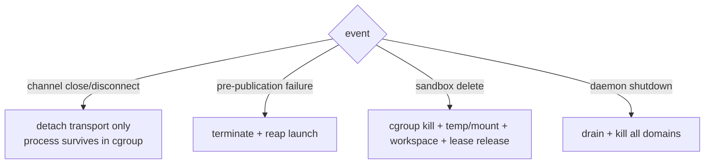
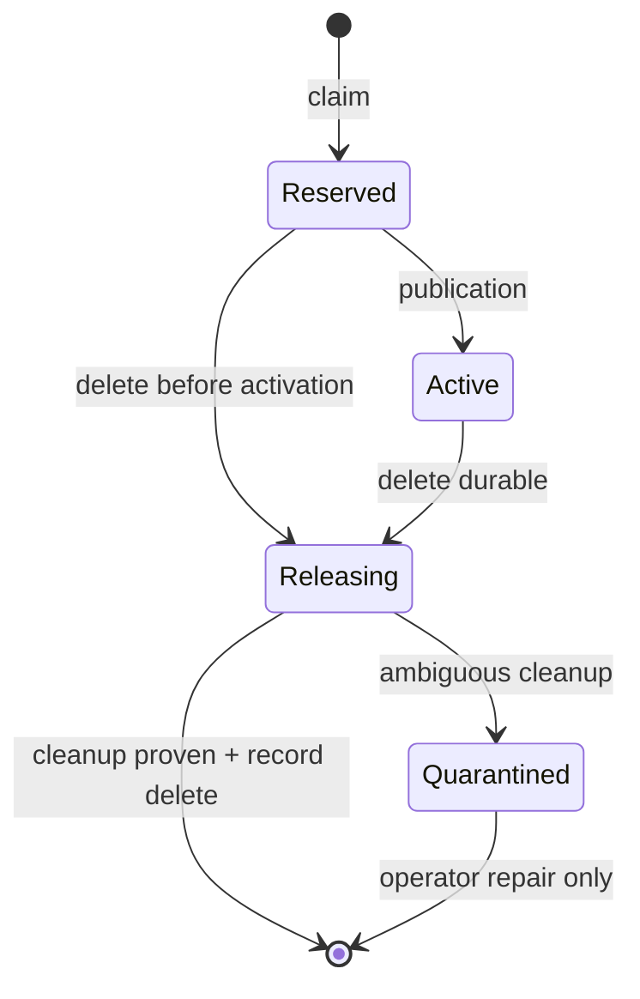

# Sandbox process lifecycle ownership

この文書は shbox の sandbox process lifecycle の所有権契約を定義する。
Linux sandbox において process の生存を誰が管理するかを layer ごとに分離し、
それぞれの layer が担う役割と担わない役割を明示する。

この契約の動機と実装計画の全体は、リポジトリのコミット履歴に保存された M0--M13 の
archival commit を参照すること。

## 1. 所有権の分離

| Layer | 所有するもの | 所有しないもの |
|---|---|---|
| SSH channel | I/O transport（wire 上の data/eof/close/signal/resize の配送） | process の生存 |
| PTY / process group | foreground job control と signal routing（端末 semantics） | sandbox 全体の process inventory |
| sandbox cgroup | その sandbox runtime に属する **すべて** の Linux process の containment | workspace や metadata の永続性 |
| durable sandbox (workspace + metadata + subordinate identity lease) | 永続状態（isolated sandbox は subordinate UID/GID lease を含む） | 実行中 process の管理 |

不変条件（invariant）:

- SSH channel は transport に過ぎない。channel の close は sandbox process の
  終了を意味しない。
- 直接 child の exit は descendant の終了を意味しない。
- sandbox delete は sandbox に属するすべての process を終了させる。
  `setsid()` による session 離脱、double-fork、daemonize 済みの descendant を含む。
- daemon の graceful shutdown はすべての sandbox process を終了させる。

- subordinate identity lease は durable sandbox と同じ lifetime を持つ。pair の
  再利用は verified release transaction（`Active -> Releasing -> cleanup 証明 ->
  record 削除 + directory fsync`）でのみ許され、process・namespace の消失や
  経過時間からの推測では解放しない。identity は process より先に確保し、
  process より後（かつ workspace/metadata と同じ delete トランザクション内）で
  解放する。
- daemon の crash/restart を跨いだ process の生存は保証しない。次回 startup は
  delegated parent 配下の shbox 所有 `shbox-domain-*` cgroup を enumerate し、
  kill → populated=0 待ち → remove する。対応する `sandbox-*` runtime temp と
  無関係な sibling cgroup はそれぞれ ownership boundary に従って扱う。

## 2. 各イベントの定義する挙動

### 2.1 直接 child の通常終了

foreground command（shell 等）が終了したとき:

- engine は直接 child のみを reap する。
- 直接 child の process group に対する追加の signal は行わない。
- detached した descendant（`&` で起動した background process、`setsid()` した
  process、double-fork した daemon）は生存を続け、sandbox cgroup は populated の
  ままになる。
- zombie の直接 child を残さない。

### 2.2 SSH channel の切断（post-publication transport loss）

`shell` / `exec` request の acknowledgment（SSH `CHANNEL_SUCCESS`）に成功した
launch において、client 側の transport が失われたとき（channel close、TCP
disconnect、connection registry の破棄、output sink の失敗）:

- daemon は transport 側の endpoint のみを閉じる（pump の停止、PTY master の
  channel 分の close、stdin/stdout/stderr の pipe 親側の close）。
- sandbox process に対して TERM/KILL を送らない。
- PTY を持つ launch では、kernel の通常の terminal hangup semantics に従う。
  interactive shell は通常 SIGHUP で終了し、`nohup` / `setsid()` 済みの process
  は生存できる。
- process は引き続き sandbox cgroup に所属し、daemon に管理される。

### 2.3 Publication 前の失敗（pre-publication failure）

client が一度も acknowledgment を受け取っていない launch の失敗
（launch 失敗、PTY setup 失敗、resize 同期失敗、`CHANNEL_SUCCESS` 送信失敗）:

- その launch を terminate し、reap し、cleanup する。
- どの client もこの launch を取得できていないため、生存させる義務がない。

### 2.4 Sandbox delete

明示的な削除は process lifecycle の hard boundary である:

1. durable metadata を `Deleting` に遷移させる。
2. 新規 launch を拒否する。
3. isolated sandbox なら subordinate identity lease を `Releasing` に durable
   遷移させる（破壊的 cleanup より前。`Reserved` のままの削除も同じ遷移で受ける）。
4. pre-publication 状態の launch を cancel する。
5. in-flight launch の barrier を待つ。
6. process domain に対して `cgroup.kill`（SIGKILL）を送る。
7. `cgroup.events` の `populated` が `0` になるまで待つ。
8. cgroup を削除する。
9. runtime temp を削除し、generation が保持する mount-ID-map user namespace の
   descriptor を閉じる。
10. workspace と durable metadata を削除する。
11. identity lease record を削除して ledger directory を fsync し、subordinate
    pair を再利用可能にする（quarantined lease は残す）。

runtime lease（manager の runtime entry）は launch race の管理には有用だが、
完全な process inventory ではない。descendant は manager に登録されないまま
cgroup に残り得るため、削除の権威は cgroup membership にある。lease の解放も
この順序に従う: process の回収証明より前に pair が再利用可能になることはない。

### 2.5 Daemon graceful shutdown

- listener の受付を停止し、manager の launch admission を freeze する。
- publication 前の launch barrier と、manager に残る runtime lease の graceful
  cleanup を完了する。
- 各 sandbox process domain に対して kill → populated=0 待ち → cgroup 削除 →
  runtime temp 削除（isolated sandbox は generation の mount-ID-map user
  namespace descriptor も共に解放）を行う。shutdown の process inventory を
  active SSH channel から導出しない。

### 2.6 Daemon restart reconciliation

startup では、新しい launcher が launch admission を開く前に、configured または
auto-discovered delegated parent の直下から `shbox-domain-*` だけを調べる。各 stale
domain は cgroup membership を権威として kill、empty wait、remove する。runtime root
では `sandbox-*` generation tree だけを recursive に削除する。名前 prefix の外側に
ある cgroup、runtime file、workspace は変更しない。cleanup の一部が失敗した場合は
manager を ready にせず、次回 startup または明示的な retry に ownership を残す。

この runtime 資源の reconciliation に続いて subordinate lease ledger を突き合わせる。
`Reserved` + published sandbox は `Active` へ昇格し（claim と activation の間の crash
window）、orphan・owner 不一致・corrupt な durable sandbox の lease は `Quarantined`
へ移す。`Releasing` の lease は、sandbox が残っていれば削除再開へ回し、sandbox が
不在で runtime 資源の reconciliation が既に process/namespace の不在を証明している
場合にのみ record を削除して pair を free にする。`Quarantined` は自動再割当て
しない。lookup 自体が失敗した場合は ledger を変更せず fail closed にする。

この resource reconciliation は durable な `Deleting` workspace の削除よりも
**前に**完了しなければならない（§1 の process ownership contract: process を必ず
workspace より先に終了させる）。reconciliation が失敗した場合、manager は ready に
ならず、`Deleting` 状態の workspace も削除しない。

### 2.7 通常終了後の runtime 資源

- runtime temp（`TMPDIR`）は launch ごとではなく sandbox runtime domain ごとに
  作られる。domain 内の全 process が終了し in-flight launch がなくなった時点で
  削除される。直接 child の exit に紐付けない。
- isolated sandbox の mount-ID-map user namespace も generation ごとの資源であり、
  runtime temp と同じ timing で解放される。domain の空化は identity lease の解放を
  意味しない（lease は §2.4 の削除 transaction でのみ解放される）。
- workspace は runtime が空になっても保持される。

## 3. Process group の役割の縮小

cgroup が process ownership の権威となった後、process group が担うのは:

- PTY foreground job の特定（`tcgetpgrp`）。
- SSH 経由の user 要求 signal の forwarding（`kill(-pgid, ..)`）。
- shell の job control semantics。
- publication 前に失敗した launch の防御的 cleanup。

process group は sandbox の process inventory ではない。`kill_process_group`
等の使用は上記の役割に紐付く場合のみ許容される。

## 4. テスト契約

この契約は以下のテスト群で固定する（M0--M13 の archival commit）:

- 直接 child の exit 後も detached descendant が生存すること。
- `setsid()` descendant が生存し、sandbox cgroup に留まること。
- channel 切断が process termination を引き起こさないこと。
- 明示的な sandbox delete がすべての process（detached を含む）を除去すること。
- 既存の process-group signal / PTY test は job-control 契約として維持する。
