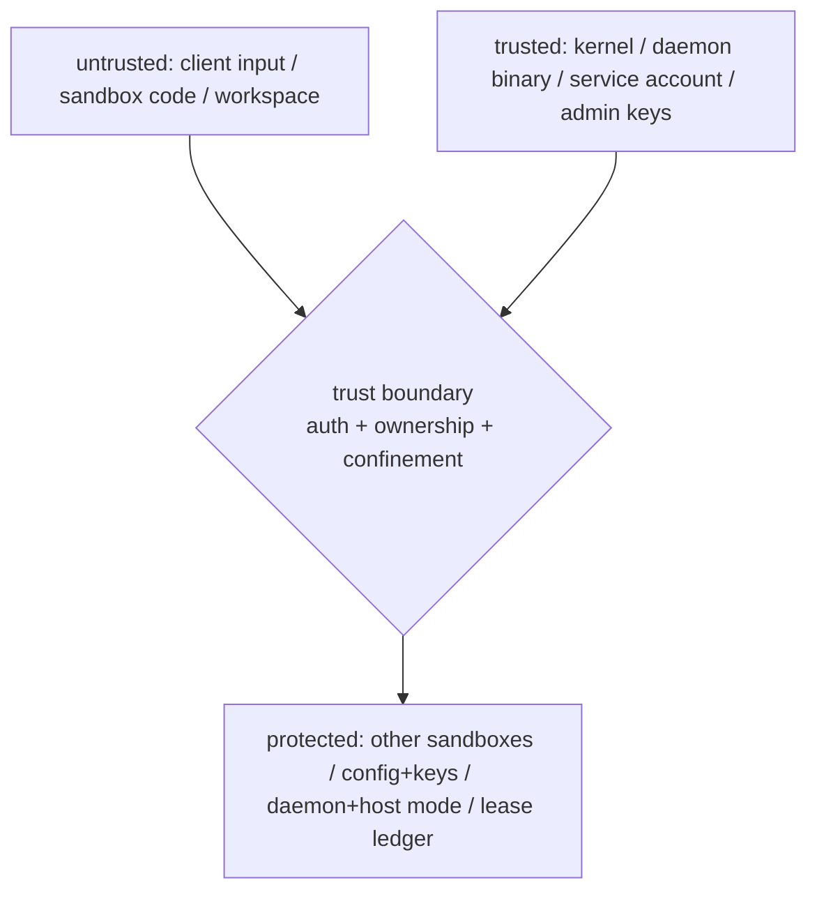

# セキュリティ仕様

shbox は SSH authentication/authorization、durable sandbox ownership、workspace path safety、OS confinement、process/PTTY lifecycle を組み合わせる。単独でVM相当の hostile multi-tenant isolationを約束するものではない。

## 1. Trust boundary と threat model

### 1.1 信頼するもの

- host kernel / OS security mechanisms
- daemon binary と locked dependencies
- daemon service account の local filesystem permissions
- Ed25519 host key / authorized public-key sources
- admin private keys の保管主体
- operator-provided config と deployment artifacts

### 1.2 信頼しないもの

- SSH client input
- sandbox username/command/environment request/terminal request
- sandbox内で実行するcode
- sandbox workspace content
- filesystem symlink/metadata raceを狙うinput
- disconnectやhalf-closeを含むtransport timing

### 1.3 保護対象



- 他sandbox workspace/metadata
- shbox config/state/host key
- daemon processとhost mode
- host filesystemの未許可path
- disabled network policyでのhost/external network reachability
- authentication/ownership metadata integrity
- PTY/process descriptor ownership
- subordinate UID/GID lease ledgerの整合性（sandbox間のID衝突と、daemon自身のUID/GIDへのmapping）

## 2. Authentication と principal

public-key authenticationだけを通常のidentity sourceとして扱う。principalはexact Ed25519 public keyのOpenSSH SHA-256 fingerprintである。

accepted authorized-key inputはbare Ed25519 line。option、certificate、他algorithm、malformed/oversized lineは拒否する。

key source:

- daemon account `~/.ssh/authorized_keys`: admin role source
- XDG config `allowed_keys`: sandbox-only role source

同じkeyが両sourceに存在する場合adminになる。

### 2.1 File safety

key sourceが存在する場合:

- regular file
- daemon user ownership
- group/world writableでない
- unsafe symlinkでない
- immediate parentも安全
- file size 1 MiB以下

を要求する。

key source更新はauthentication requestごとにidentityを再確認する。invalid changeはcurrent valid snapshotを破壊せず、authenticationをfail closedにする。SIGHUPは再検証を強制する。

## 3. Role / selector / ownership

normal principalはvalid `SandboxId`をusernameとしてsandbox routeを使う。`_`はreserved host selectorでadminだけが利用可能。

ownershipの正本はdurable metadataのowner fingerprintであり、username文字列やfilesystem ownerから推測しない。

最初のclaimはatomicにownerを確定する。ownerでないnormal keyは既存sandboxへ入れない。delete/listも同じprincipal metadata policyを使う。

admin host modeはsandbox confinementを通らないため、admin credential compromiseはhost service account compromiseに近いimpactを持つ。

## 4. Persistent filesystem protection

### 4.1 XDG roots

config/data/state rootsは用途を分離する。shboxが書くdirectoryはowner-only、安全なreal directoryを要求する。symlinkやgroup/world writable directoryを拒否する。

### 4.2 Sandbox path

外部文字列を直接path joinする前に`SandboxId`へvalidateする。grammarはASCII/case-sensitiveの:

```text
[A-Za-z0-9][A-Za-z0-9-]{0,63}
```

である。

workspace/metadata操作はsafe directory/file primitiveとdurable lifecycle stateを組み合わせる。corrupt metadataを勝手にownershipへ変換しない。

### 4.3 Read/write policy

sandbox processの意図したwrite surface:

- own workspace
- own private runtime temp directory on Linux; per-launch temp on macOS
- `/dev/null`

system/runtimeのcurated pathとconfigured `read_paths`はread-only。other sandbox、shbox config/data/state、host shared tempをbroad write grantしない。

isolated identityのsandboxでは、このwrite surfaceはさらにmount layerで制約される。workspace/runtime tempへの書き込みはleased subordinate UID/GIDにmapされたdetached mount経由のみで、継承したmount tree全体はchild内で再帰的にread-onlyになる。host filesystem上の当該fileのownerはleased subordinate UID/GIDとなり、daemon accountが作成したfileとはDAC levelで区別される。

## 5. Process confinement boundary

### 5.1 Backend-neutral policy

SSH layerはOS sandbox typeを知らない。validated `SandboxLaunchPolicy`からproduction `ProcessLauncher`がOS-specific confinementを構築する。

policyには:

- shell
- network mode
- identity mode（`host`はdaemonのDAC identity、`isolated`はsubordinate UID/GID lease + mapped user namespace。Linux runtimeのみ）
- curated/configured read paths
- operator environment
- private runtime temp root (Linux generation-scoped; per-launch on macOS)
- configured resource limits with platform-specific enforcement

file-size、open-file、workspace disk quota は持たない。

### 5.2 Linux

Linuxはshbox-sandbox engineでprepared Landlock policyを構築する（clone3+pidfd生成、no_new_privs、capability drop、close_range FD hygieneがinvariant）。

security-critical rules:

- path resolution/policy constructionはparentで完了
- post-fork childはallocation-heavy builderを呼ばない
- Landlock policy apply前にworkspace/session/PTTY setupをfixed raw operationで行う
- disabled networkはfresh user+network namespaceでhost/external reachabilityを切り離し、Landlock network mediation（ABI 4+）でもTCP `bind`/`connect`を拒否する。namespace/capability setupに失敗した場合はfail closedする
- identity helper（`newuidmap`/`newgidmap`）やID-map brokerが要求を満たさない場合、daemon identityへfallbackせずlaunchをfail closedで拒否する
- signal/IPC scopingはkernel ABIが提供する範囲でrequestする
- project-owned external sandbox executable、sibling helper、self-exec pathへshell outしない（`newuidmap`/`newgidmap`と`getsubids`はadministrator所有PATH上のshadow-utils helper、`shbox-idmap-broker`はsocket activationされる固定binary）

Landlock confinementはdescendantへinheritされる。

### 5.2.1 Identity isolation（`identity = "isolated"`）

isolated sandboxは、durableなsubordinate UID/GID lease（1 sandbox に 1 組）と fresh user namespaceでdaemon資格から分離されたidentityで動く。defaultの`host` modeはdaemonのDAC identityを保持する互換modeであり、network disabled時に使うcaller-mapped user namespace（`unshare --map-root-user`相当）はisolationではない。

mapping barrier。childは`clone3(CLONE_NEWUSER)`直後に`MAP_READY`を送ってblockし、mapのinstallはparent側が行う。engineはpidfdでchildのPIDをpinしたまま、`/proc/<pid>`のdirectory fdを継承した`newuidmap`/`newgidmap`（`fd:N`形式、env clear、固定PATH、PID pathへのfallbackなし）で「runtime ID 1000 ↔ leased host ID・長さ1」の単一entry mapをinstallし、読み戻して完全一致と`setgroups`が`allow`であることを確認してからchildを解放する。helper失敗・map不一致・child早期死亡はすべてkill & reapでfail closedする。namespaceのUID/GID 0は意図的にunmapし、leaseのhost IDにdaemon自身のUID/GIDを指定することをengine側で拒否する。

identity transition。user code実行前に`setresgid` → supplementary group全消去 → `setresuid` → securebits lock（`NOROOT`/`NO_SETUID_FIXUP`/`NO_CAP_AMBIENT_RISE`全部lock）→ `no_new_privs` → capability全dropの順で遷移する。最終stateはUID/GID 1000（real/effective/saved）・supplementary groupなし・capability 0・`NoNewPrivs` 1であり、native testが`/proc/self/status`で固定する。

mount layer。ID-mapped mount作成に必要なroot権限はdaemonに与えない（daemonは`CAP_SYS_ADMIN`を持たない）。daemonはsocket activationされた`shbox-idmap-broker`（root・initial user namespace）に固定長requestとSCM_RIGHTSでmount-ID-map user namespace FDとsource directory FDを渡し、detached mount FDを受け取る。brokerは`SO_PEERCRED`のpeer credential（root peerは拒否）とsource FD（daemon所有・group/world writableでない・削除済みでない・設定されたdata/runtime root配下・leased IDは0でもdaemonのIDでもない）だけを検証し、任意のpathnameやcommandを受け取らない。childは継承mount treeを`mount_setattr`で再帰的にread-only化し、broker由来のdetached mountのみをdescriptor指定でattachする。mount-ID-map用のauxiliary user namespaceはruntime-domain generationごとに作られ、generationと共に解放される。

lease ledger。subordinate pairの選択と遷移はdurable ledger（`subid-leases`、daemon所有の0700 directory、1 record 1 TOML file）で直列化する。pairはUID/GID poolそれぞれで最低availableを選び、ID 0と`Releasing`/`Quarantined`のpairは決して選ばない。重複recordはcorruptionとして停止する。`lease_id`（128-bit）によるincarnation checkで、同一numeric pair再利用後のstale cleanupが新leaseを解放できないようABA保護する。delegation（`getsubids`/`getsubids -g`でNSS対応で発見。`/etc/subuid`はparseしない）はprocess-lifetime可変であり、新規claimと既存leaseの使用前に毎回再照会する。delegation外になったleaseはrecordを保持したまま新規launchをfail closedにする（削除は可能）。pairの解放はverified release transaction（`Active -> Releasing`を破壊的cleanup前にdurable記録 → cleanup証明 → record削除 + directory fsync）のみで、restart reconciliationはruntime資源の回収を証明した後にはじめて`Releasing` + sandbox不在のrecordを解放する。

### 5.3 macOS

macOSはparentがdeny-default Seatbelt profileを生成し、固定system executable `/usr/bin/sandbox-exec`へ渡す。

profile生成はchild fork前に完了する。PTY setupはshbox自身が行い、Seatbelt適用toolにterminal ownershipを任せない。

macOSの`memory_max`は`RLIMIT_AS`、`pids_max`は`RLIMIT_NPROC`としてexec前に適用する。CPU quotaとswap limitは表現できず、指定時はfail closedする。`/usr/bin/sandbox-exec`は固定OS componentとして許可される唯一の外部 launcher であり、project-owned helperではない。

formal supportはfixed macOS major/arm64 native gateでenforcement smokeを通したtupleだけに付与する。

## 6. Network policy

### 6.1 `disabled`

全platformのpublic contractはhost/external network reachabilityを拒否することである。Linuxではfresh user+network namespaceに隔離したうえでLandlockがTCP `bind`/`connect`も拒否する。sandboxed programはcapability drop後にexecされるため、初期状態でdownのloopbackを再構成できない。macOSではdeny-default Seatbelt profileがnetwork operationを許可しない。release testsではTCPに加えてUDPの外部到達不能も確認する。

### 6.2 `outbound`

outbound client connectionを利用可能にするmodeである。remote destination allowlistやproxy policyではない。Linuxの現在のbackendはclient-onlyより広いsocket accessを許し得る一方、macOSはbind/inboundをallowしない。portableなinbound guaranteeはないため、外部到達性はhost/provider firewallも含めoperatorが制御する。

### 6.3 Fail closed

platform-specific な network enforcement prerequisite（Linux の Landlock ABI 4+、macOS の Seatbelt launcher）が不足する場合 launch を拒否する。required enforcementを外してcommandを実行しない。network namespace isolationを使う構成では、必要な namespace setup（user namespace または適切な privilege を含む）の作成・設定に失敗した場合も fail closed する。

## 7. Environment protection

shboxがauthoritativeに設定する:

```text
HOME PWD SHELL TMPDIR TERM(PTY時)
```

をoperator/clientにshadowさせない。

`[sandbox.env]`はPOSIX identifier/4KiB value validationに加え、loader/interpreter/proxy/certificate/tool injectionに使えるreserved name/prefixを拒否する。

SSH `env` requestはconnectionを壊さず拒否し、sandbox processへ渡さない。

commandは32KiB以下、NULなし、sandbox execではUTF-8としてshell `-c`へ渡す。

## 8. PTY and descriptor security

PTYはshbox-owned resourceである。

- master/slaveをCLOEXECにする
- child setup専用fdを明示的に予約
- childだけがslaveをfd0/1/2へduplicate
- childがnew session + controlling terminalを取得
- parentはspawn後slave/setup fdを閉じる
- lifecycle ownershipとしてmasterだけを保持

masterがchildへ余分にinheritするとEOF/HUP semanticsを壊すため、CLOEXEC ownershipはblocking regression testで固定する。

concurrent sessionsでterminal device、foreground process group、window size、signalがcross-talkしないことをreal OpenSSHで検証する。

## 9. Process lifecycle and cleanup

normal process completionではengine-owned direct childをexactly once reapする。Linux の
共有 process domain は直接 child の exit では削除せず、残った descendant を domain の
membership として保持する。PID namespace有りでは内部PID1 supervisorがlogical user
PID2をreapし、そのstatusをparentへ返して終了する。

abnormal teardownでは、published sandbox launchのchannel close/connection
disconnectはtransport endpointだけをdetachする。process terminationを行うのは
publication前の失敗、sandbox delete、daemon shutdownであり、graceful signal後に
timeoutでforce killへescalateする。

connection handler drop時はchannel registry senderをclearし、bridge taskがdisconnectを確実に観測する。bridgeがconnection stateの`Arc`を保持しているだけでprocessが残り続けないようにする。

Linux の engine-owned direct child には parent-death signal を設定し、その clone は process-lifetime の専用 spawn-owner thread が実行する。PID namespace 有りでは direct child は内部 PID1 supervisor で user command は PID2 として実行される。daemon abrupt death 時に process の生存は保証しないが、次回 startup は delegated parent の shbox 所有 `shbox-domain-*` と runtime root の `sandbox-*` generation を回収する。ownership prefix 外の sibling cgroup/file は変更しない。

### 9.1 Detached descendant containment

Linux の SandboxId ごとの cgroup process domain が process inventory と delete/
shutdown の containment boundary である。sandbox code が deliberate に `setsid()` や
double-fork で別 session/process groupへ detachしても、同じ domain に所属する限り
`cgroup.kill` の対象から外れない。delegated cgroup parent と runtime root は
同時に 1 つの shbox daemon instance のみが所有する（排他所有権。詳細は
configuration.md §resource limits）。

process group は sandbox inventory ではなく、PTY foreground job lookup、SSH signal
forwarding、shell job control、publication前の abandoned launch の graceful cleanup
に限定する。filesystem/network confinement inheritance と process lifecycle
containment は別の security property として扱い、provider acceptance では domain
membership と delete/shutdown の回収を明示的に観測・記録する。

## 10. Resource control

shbox v0.1は、設定された resource limit を sandbox ごとに platform ごとの primitive で適用する。Linux は cgroup v2、macOS は `memory_max` を `RLIMIT_AS`、`pids_max` を `RLIMIT_NPROC` として扱う。macOS の rlimit は Linux のような sandbox process-tree cgroup accounting ではない。

Linux の public shbox adapter では、limit の有無にかかわらず `SandboxId` ごとに一つの durable な process domain（専用 cgroup v2）を作成し、同じ `SandboxId` の concurrent launch が共有する。child はその domain に直接生成され、child exit では domain を削除しない。sandbox deletion が runtime cancellation と child cleanup を完了した後に domain を release/remove する。limit を省略した分野は `Inherit` であり、その controller の sandbox-local 制限を書き換えない。直接 `shbox-sandbox::Sandbox::spawn` を利用する engine path は、resource limit を使う場合に spawn ごとの one-shot per-child cgroup semantics を採用し得る。

limit は parent/ancestor cgroup の制限に追加され、child が inherited cgroup restriction を解除または引き上げることはできない。daemon crash 時に process を残す保証はないが、restart 時の stale-owned domain/temp reconciliation はこの lifecycle contract に含まれる。

提供しないもの:

- file-size/open-file quota
- workspace disk quota

macOS の CPU quota と swap limit は unsupported で、指定時は黙って無視せず fail closed する。built-in connection/channel/process count capsはdaemon admission protectionであり、sandbox内process treeのresource controlではない。

service manager/providerがdaemon全体へ追加のresource policyを設定することは可能だが、その保証をshbox sandboxのsecurity claimへ転記しない。

## 11. Host mode

`_` routeはadmin-onlyでsandbox confinement外。host shell processもsession/process-group cleanupとparent-death handlingを持つが、sandbox filesystem/network policyはない。

host modeでcommand text/outputにsecretが含まれ得るため、default logへraw command/terminal contentを出さない。

## 12. SSH attack surface

明示的にsupportするterminal operations:

- shell
- exec
- PTY request
- window change
- bounded RFC signal request
- `list` subsystem
- `delete` subsystem

拒否するもの:

- SFTP
- unknown subsystem
- unsupported channel/request type
- client environment injection
- invalid/oversized terminal name、subsystem name、command
- invalid selector

channel mailbox/output buffersはboundedにし、full mailboxでinputをsilent dropせずchannelをcloseしてfail safeにする。

## 13. Error disclosure / logging

clientへはgeneric failureを返し、次を公開しない。

- absolute internal XDG paths
- policy builder error chain
- other sandbox metadata
- key source details
- backend raw diagnostic internals

operator logにはstartup/preflight/kernel capability/cleanup failureなど必要な診断を残せるが、raw stdin/stdout/stderr、terminal bytes、secret environment、private key materialを記録しない。

## 14. Shutdown security

first SIGINT/SIGTERM:

1. listener drain
2. sandbox/host runtime termination
3. waiter/cleanup completion
4. daemon exit

second shutdown signalはforce-stop pathへ移る。

SIGHUPはkey sourcesだけを再検証する。config/network/path policyをlive reloadしてconnection間でpolicy versionが混在することを避ける。

## 15. Security acceptance criteria

releaseには少なくとも:

- Rust 1.95 fmt/clippy/test/build
- Linux x86_64/aarch64 native engine/Landlock gate
- macOS 15/26 arm64 native Seatbelt gate
- workspace write + outside read/write denial
- disabled network external TCP/UDP denial / outbound success
- non-PTY streams/status
- full PTY session/job-control suite
- disconnect transport detach / delete and shutdown cleanup
- no PTY slave/fd leak
- concurrent PTY isolation
- migration guard for retired helper/control paths
- production providerをclaimする場合はそのexact image/kernel acceptance

を要求する。

## 16. Security non-goals

- kernel/root compromise防御
- VM-grade tenant isolation
- admin key compromise防御
- covert/side-channel isolation
- per-sandbox UID namespace
- documented resource limitsを超えるfile/workspace quotaや、ancestor cgroup restrictionの解除
- Linux の管理対象 process domain 外にある任意の host process tree の完全回収保証

これらが必要なdeploymentは別のVM/container/provider boundaryを追加する。

## 17. 関連文書

- [architecture.md](architecture.md)
- [configuration.md](configuration.md)
- [platforms.md](platforms.md)
- [ssh-protocol.md](ssh-protocol.md)
- [testing.md](testing.md)
- [release.md](release.md)
